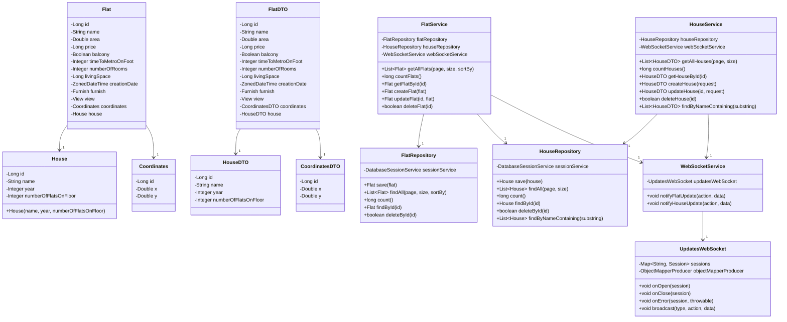

# Диаграмма классов

```mermaid
classDiagram
    class House {
        -Long id
        -String name
        -Integer year
        -Integer numberOfFlatsOnFloor
        +House(name, year, numberOfFlatsOnFloor)
    }

    class Flat {
        -Long id
        -String name
        -Double area
        -Long price
        -Boolean balcony
        -Integer timeToMetroOnFoot
        -Integer numberOfRooms
        -Long livingSpace
        -ZonedDateTime creationDate
        -Furnish furnish
        -View view
        -Coordinates coordinates
        -House house
    }

    class Coordinates {
        -Long id
        -Double x
        -Double y
    }

    class HouseDTO {
        -Long id
        -String name
        -Integer year
        -Integer numberOfFlatsOnFloor
    }

    class FlatDTO {
        -Long id
        -String name
        -Double area
        -Long price
        -Boolean balcony
        -Integer timeToMetroOnFoot
        -Integer numberOfRooms
        -Long livingSpace
        -ZonedDateTime creationDate
        -Furnish furnish
        -View view
        -CoordinatesDTO coordinates
        -HouseDTO house
    }

    class CoordinatesDTO {
        -Long id
        -Double x
        -Double y
    }

    class HouseService {
        -HouseRepository houseRepository
        -WebSocketService webSocketService
        +List~HouseDTO~ getAllHouses(page, size)
        +long countHouses()
        +HouseDTO getHouseById(id)
        +HouseDTO createHouse(request)
        +HouseDTO updateHouse(id, request)
        +boolean deleteHouse(id)
        +List~HouseDTO~ findByNameContaining(substring)
    }

    class FlatService {
        -FlatRepository flatRepository
        -HouseRepository houseRepository
        -WebSocketService webSocketService
        +List~Flat~ getAllFlats(page, size, sortBy)
        +long countFlats()
        +Flat getFlatById(id)
        +Flat createFlat(flat)
        +Flat updateFlat(id, flat)
        +boolean deleteFlat(id)
    }

    class HouseRepository {
        -DatabaseSessionService sessionService
        +House save(house)
        +List~House~ findAll(page, size)
        +long count()
        +House findById(id)
        +boolean deleteById(id)
        +List~House~ findByNameContaining(substring)
    }

    class FlatRepository {
        -DatabaseSessionService sessionService
        +Flat save(flat)
        +List~Flat~ findAll(page, size, sortBy)
        +long count()
        +Flat findById(id)
        +boolean deleteById(id)
    }

    class WebSocketService {
        -UpdatesWebSocket updatesWebSocket
        +void notifyFlatUpdate(action, data)
        +void notifyHouseUpdate(action, data)
    }

    class UpdatesWebSocket {
        -Map~String, Session~ sessions
        -ObjectMapperProducer objectMapperProducer
        +void onOpen(session)
        +void onClose(session)
        +void onError(session, throwable)
        +void broadcast(type, action, data)
    }

    %% Отношения
    Flat --> "1" House
    Flat --> "1" Coordinates
    FlatDTO --> "1" HouseDTO
    FlatDTO --> "1" CoordinatesDTO
    
    FlatService --> "1" FlatRepository
    FlatService --> "1" HouseRepository
    FlatService --> "1" WebSocketService
    
    HouseService --> "1" HouseRepository
    HouseService --> "1" WebSocketService
    
    WebSocketService --> "1" UpdatesWebSocket
```
