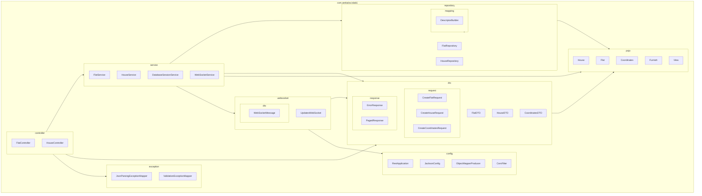

# Диаграмма пакетов

```mermaid
flowchart TB
    subgraph com.arekalov.islab1
        subgraph controller[controller]
            FlatController
            HouseController
        end

        subgraph service[service]
            FlatService
            HouseService
            DatabaseSessionService
            WebSocketService
        end

        subgraph repository[repository]
            FlatRepository
            HouseRepository
            subgraph mapping[mapping]
                DescriptorBuilder
            end
        end

        subgraph pojo[pojo]
            House
            Flat
            Coordinates
            Furnish
            View
        end

        subgraph dto[dto]
            subgraph request[request]
                CreateFlatRequest
                CreateHouseRequest
                CreateCoordinatesRequest
            end
            subgraph response[response]
                ErrorResponse
                PagedResponse
            end
            FlatDTO
            HouseDTO
            CoordinatesDTO
        end

        subgraph config[config]
            RestApplication
            JacksonConfig
            ObjectMapperProducer
            CorsFilter
        end

        subgraph websocket[websocket]
            UpdatesWebSocket
            subgraph websocket_dto[dto]
                WebSocketMessage
            end
        end

        subgraph exception[exception]
            JsonParsingExceptionMapper
            ValidationExceptionMapper
        end
    end

    %% Зависимости между пакетами
    controller --> service
    controller --> dto
    controller --> exception

    service --> repository
    service --> dto
    service --> pojo
    service --> websocket

    repository --> pojo
    repository --> mapping

    websocket --> dto
    websocket --> config

    dto --> pojo
```
